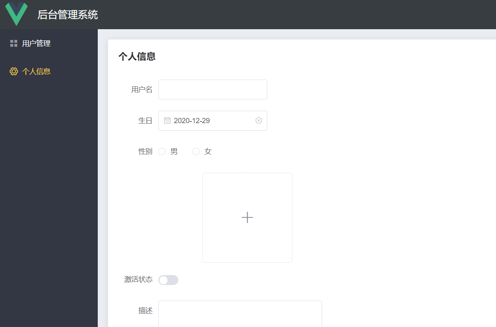

# ManagementSystem-Server
## 项目介绍：

### 项目链接：

前端：vue + element-ui pc端后台管理系统

:point_right: [前端项目链接](https://github.com/zizihao/ManagementSystem-View)  

后端：node + express + mysql 服务器

:point_right: [后端项目链接](https://github.com/zizihao/ManagementSystem-Server)  

### 说明：

这个项目还在开发中，目前只加了登录，用户管理等模块，有时间博主就会接着写，有兴趣全栈的小伙伴可以看下。可以在github给我留言。

后端用了express框架，有文件上传，处理跨域，操作数据库和mysql自动断连等知识点。数据库备份还没做💦，表结构很简单，就一个user表。

前端就正常的后台管理系统的写法，会有vue-element-admin框架的味道，毕竟博主就是按着这个框架学的后台管理系统😝，可能很多功能还没加进去，比如vuex，等项目大起来后按需加入。

### 主要的技术栈：

#### 前端：

 :bike: less： CSS 预处理语言 。项目放在css文件夹内，引入用编译完成的.css的文件

 :helicopter: vue： 用于构建用户界面的渐进式框架。

 :umbrella: vue-router：vue官方路由插件

**使用到的库：**

 :zap: axios： 一个基于 promise 的HTTP库 ，用来发ajax

 :whale2: element-ui：UI 库，饿了么团队维护，主要是针对pc端

#### 后端：

🥽 node：原生node也是写服务端不可或缺的

🧶express： 基于 Node.js 平台，快速、开放、极简的 Web 开发框架 

📀 mysql：关系型数据库

**使用到的库：**

🎈 body-parser：post请求处理库

🎈 jsonwebtoken：token加密解密库

🎈 multer：上传文件处理库

## 项目预览：



## 完成功能：

-  登录，注册 
-  用户管理
-  文件上传

## 目录结构：

**前端：**

```
├── /public/         # 静态文件
├── /src/            # 源码目录
│ ├── /api/          # 请求
│ ├── /assets/       # 组件静态资源(图片)
│ ├── /components/   # 公共组件
│ ├── /plugin/       # 插件
| | ├── element.js   # element-ui配置
│ ├── /router/       # 路由配置
│ ├── /views/        # 路由组件(页面维度)
│ ├── /utils/        # 工具库
| | ├── request.js   # axios请求配置
│ ├── App.vue        # 组件入口
│ └── main.js        # 程序入口
├── .gitignore       # git忽略文件
├── package.json     # 项目依赖
└── README.md        # 项目文档
```

**后端：**

```
├── /bin/            # 可执行
│ ├── /www           # 服务启动配置项
├── /model/          # 数据层
│ ├── /main.js       # 方法导出
│ ├── /config.js/    # mysql连接配置
│ ├── /public/       # 静态文件
├── /router/         # 路由配置
├── /utils/          # 工具库
│ ├── /jwt/          # token方法库
│ ├── /myPort/       # 服务启动URL端口
│ ├── /public/       # 公共方法库
├── app.js           # 程序主体
├── .gitignore       # git忽略文件
├── package.json     # 项目依赖
└── README.md        # 项目文档
```

## 项目启动：

### 前端：

#### 下载项目依赖

```
npm install
```

#### 启动开发服务

```
npm run serve
```

#### 打包

```
npm run build
```

### 后端：

#### 下载项目依赖

```
npm install
```

#### 启动mysql数据库

#### 启动服务器

```
node bin\www
```
